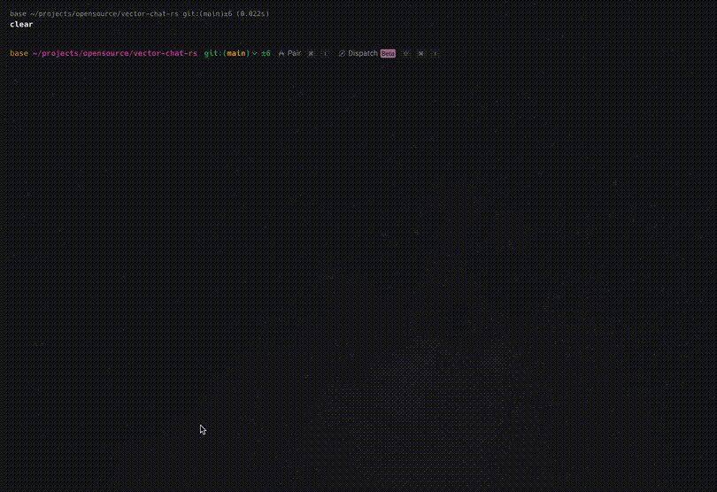

# Vector Chat - Rust Version

[](https://www.rust-lang.org)

A Rust implementation of a semantic search and AI-powered chat system using OpenAI embeddings and Qdrant vector
database.



## Features

- Text embedding using OpenAI's embedding models
- Vector storage in Qdrant database
- Semantic search for relevant context
- AI-powered chat with context retrieval
- Command-line interface for easy interaction

## Prerequisites

- [OpenAI API key](https://platform.openai.com/api-keys)
- [Rust](https://www.rust-lang.org/tools/install) (1.65.0 or later)
- [Qdrant](https://qdrant.tech/)

**Note:** You can run Qdrant using docker, or visit the [official website](https://qdrant.tech/) for more information.
```bash
docker run -p 6333:6333 qdrant/qdrant
```

## Setup

Create a `.env` file with your OpenAI API key and Qdrant settings:

   ```
   # OpenAI API Key
   OPENAI_API_KEY=your_openai_api_key_here

   # Qdrant settings (using local Qdrant instance by default)
   QDRANT_URL=http://localhost:6333
   QDRANT_COLLECTION=rustchat
   # QDRANT_API_KEY=your_qdrant_api_key_if_needed

   # OpenAI models
   DEFAULT_CHAT_MODEL=gpt-4o
   DEFAULT_EMBEDDING_MODEL=text-embedding-3-small
   ```

## Usage

### Embedding Text

```bash
# Embed a file
cargo run embed --file path/to/file.txt

# Embed direct text input
cargo run embed --text "This is some text to embed"

# List available text files
cargo run embed --list-files
```

### Chat with Context

```bash
# Chat with context retrieval (default)
cargo run chat

# Chat without context retrieval (using only OpenAI's knowledge)
cargo run chat --no-context
```

## Build the project:

```bash
cargo build --release
```

```bash
# Embed a file
./target/release/vector-chat embed --file path/to/file.txt

# Embed direct text input
./target/release/vector-chat embed --text "This is some text to embed"

# List available text files
./target/release/vector-cha embed --list-files

# Chat with context retrieval (default)
./target/release/vector-cha chat
```

## Installation

You can install the binary directly using:

```bash
cargo install --path .
```

This will make the `vector-chat` command available globally.

## License

[MIT License](LICENSE) 